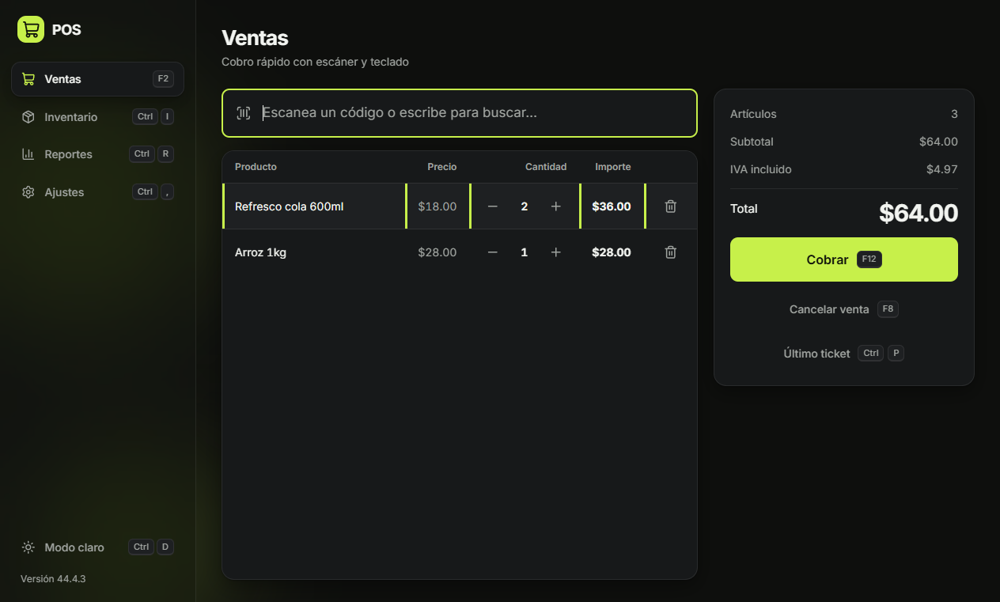
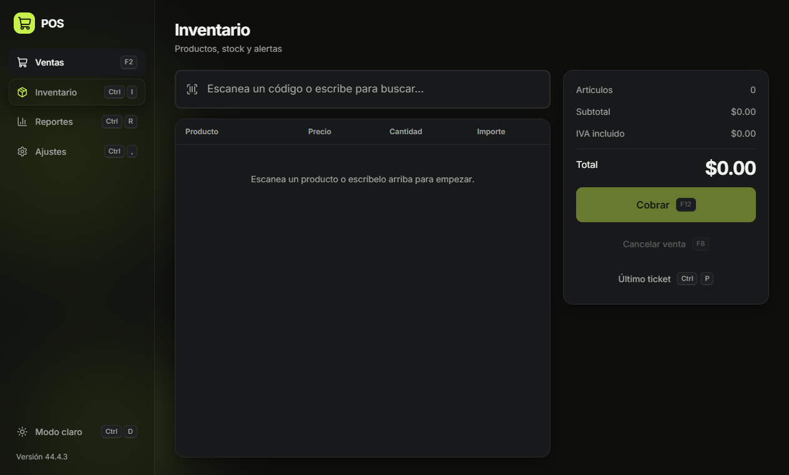
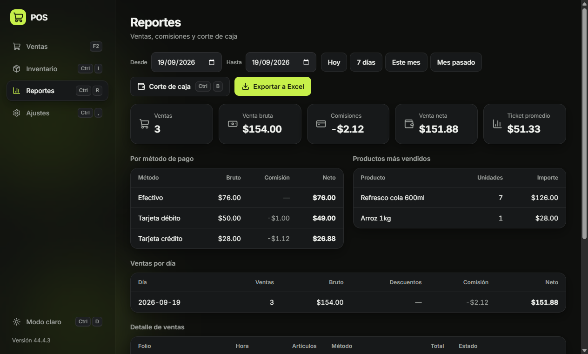
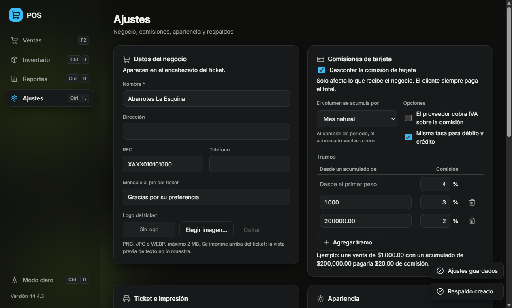

# POS Offline

Punto de venta de escritorio que funciona **sin conexión a internet**. Pensado para
un mostrador real: vender es rápido, se opera con el teclado y los datos viven en un
archivo local que puedes respaldar copiando y pegar.



## Características

- **Venta en segundos.** Escaneas, cobras, imprimes: `F2` → escanear → `F12` → cobrar.
  El lector de código de barras USB funciona sin instalar nada y en cualquier pantalla:
  no hace falta tener el cursor puesto en la caja de búsqueda.
- **Funciona sin internet.** Toda la operación es local; no hay servidor ni cuenta que crear.
- **Inventario** con precios, costos, márgenes y alertas de stock bajo.
- **Descuentos** sobre la venta, en pesos o en porcentaje, y **precio a mano** por línea
  para vender a granel o hacer un precio especial.
- **Métodos de pago:** efectivo (con cálculo de cambio), débito, crédito, transferencia y
  pago mixto.
- **Comisiones de tarjeta configurables por tramos**, con el porcentaje que baja según el
  volumen acumulado del mes. Al cobrar ves cuánto recibe realmente el negocio.
- **Ticket** para impresora térmica de 58 u 80 mm, o exportado a PDF. Con una impresora
  fija sale directo, sin diálogo de Windows en cada venta.
- **Cajón de dinero:** se abre solo al cobrar en efectivo, a través de la impresora.
- **Reportes por rango de fechas** con gráficos de venta diaria, reparto por método de
  pago y ranking de productos, más el detalle en tabla y exportación a Excel. También se
  busca una venta por folio, sin acertar la fecha.
- **Corte de caja** con arqueo: compara lo que debería haber en el cajón contra lo que
  contaste y registra la diferencia.
- **Devoluciones y cancelaciones**, con reposición automática de stock.
- **Usuarios con PIN y roles** (administrador y cajero), opcionales.
- **Historial** de cambios de precio y movimientos de inventario.
- **Respaldos y restauración** de la base de datos, con respaldo automático diario.
- **Actualizaciones** desde la propia aplicación, sin perder datos.
- **Modo claro y oscuro**, con acento configurable.

## Cómo funcionan los precios

El precio que capturas es **el que paga el cliente, con IVA incluido**. A partir de él
el sistema deriva el precio sin IVA y el margen sobre el costo de compra:

| Campo | Significado |
|---|---|
| Precio al público | Lo que cobras. Incluye IVA. |
| Sin IVA | Calculado a partir del precio y la tasa. |
| Costo | Lo que te costó el producto. |
| Margen | Sobre el precio **sin IVA**: el impuesto no es ganancia. |

Todo el dinero se guarda y se calcula en centavos enteros, no en decimales flotantes,
para que los totales no arrastren errores de redondeo.

## Atajos de teclado

Cada botón muestra su atajo. `F1` abre la lista completa desde cualquier pantalla.

| Tecla | Acción |
|---|---|
| `F1` | Ayuda: lista de atajos |
| `F2` | Nueva venta / enfocar el escáner |
| `F3` | Buscar producto |
| `F4` | Elegir método de pago y cobrar |
| `F7` | Descuento de la venta |
| `F8` | Cancelar la venta en curso |
| `F12` | Cobrar |
| `Ctrl+N` | Nuevo producto |
| `Ctrl+P` | Reimprimir el último ticket |
| `Ctrl+I` | Ir a Inventario |
| `Ctrl+R` | Ir a Reportes |
| `Ctrl+B` | Corte de caja |
| `Ctrl+E` | Exportar el reporte a Excel |
| `Ctrl+,` | Ir a Ajustes |
| `Ctrl+D` | Alternar modo claro/oscuro |
| `Ctrl+L` | Bloquear la caja |
| `+` / `-` | Cambiar la cantidad del artículo seleccionado |
| `Supr` | Quitar el artículo del carrito |
| `Esc` | Cerrar o cancelar |

## Inventario



Alta de productos manual o por código de barras, búsqueda y filtros, ajustes de stock
con motivo registrado, y baja lógica: un producto desactivado desaparece de la venta
pero las ventas anteriores lo conservan.

## Reportes y corte de caja



Los reportes se filtran por rango de fechas y separan lo que vendiste de lo que
**realmente recibes**: cada método de pago muestra su bruto, su comisión y su neto.
Un pago mixto se reparte correctamente entre efectivo y tarjeta.

El corte de caja calcula cuánto debería haber en el cajón (fondo inicial + ventas en
efectivo) y lo compara con lo que contaste, registrando el sobrante o el faltante.
Cada corte guarda además un respaldo automático de la base de datos.

La exportación a Excel genera un libro con seis hojas: resumen, ventas por día,
métodos de pago, productos, detalle de ventas y cortes de caja. Los importes van en
pesos con formato de moneda, listos para usar en fórmulas.

## Ajustes



Los datos del negocio y el logo van al ticket. Las comisiones de tarjeta se configuran
por tramos: defines desde qué volumen acumulado baja el porcentaje, y el editor avisa
si los tramos no son coherentes. Nada se guarda sin validarse: el proceso principal
revisa la configuración aunque la pantalla la deje pasar.

También se elige la impresora del ticket y se imprime uno de prueba para calibrarla sin
cobrar nada. Si tienes cajón de dinero, se configura aquí: no se conecta a la computadora
sino a la impresora, y se abre solo cuando la venta lleva efectivo. El botón «Probar el
cajón» manda el pulso para comprobar el cable antes de abrir el negocio.

Desde aquí también puedes respaldar la base, guardar una copia para llevártela a otra
computadora o restaurar desde un respaldo. Antes de restaurar se comprueba que el
archivo sea una base de este sistema y se respalda la actual, por si te arrepientes.

## Devoluciones y cancelaciones

Desde el detalle de ventas puedes **devolver** piezas sueltas o la venta completa: el stock
vuelve, se registra el motivo y el importe se descuenta del neto en los reportes. La venta
original nunca se modifica, así el histórico sigue siendo fiel a lo que pasó.

**Cancelar** es distinto: deshace la venta entera y repone todo. Una venta que ya tiene
devoluciones no se puede cancelar —repondría el stock dos veces y regresaría un dinero que
el cliente ya recibió—; para dejarla en cero se devuelve lo que falte, y al no quedar piezas
la venta pasa sola a «devuelta».

## Usuarios y roles

Son opcionales. Mientras no crees ningún usuario, la aplicación abre sin PIN y permite todo.
Al crear el primero se empieza a pedir PIN al arrancar.

| | Administrador | Cajero |
|---|---|---|
| Vender, cobrar, imprimir | Sí | Sí |
| Corte de caja y reportes | Sí | Sí |
| Ver inventario e historial | Sí | Sí |
| Crear o editar productos y precios | Sí | No |
| Ajustar stock | Sí | No |
| Cancelar ventas y devolver | Sí | No |
| Ajustes, usuarios y respaldos | Sí | No |

Los permisos se comprueban en el proceso principal, no solo en la pantalla: ocultar un botón
no es una medida de seguridad.

## Instalación

Descarga el instalador o la versión portable desde
[Releases](https://github.com/EricMtz21/pos/releases). La portable no instala nada:
se ejecuta directamente.

Desde **Ajustes → Actualizaciones** puedes buscar versiones nuevas. Eso sí necesita
internet; vender no. Actualizar nunca borra tu información, porque la base de datos
vive fuera de la aplicación.

## Compilar desde el código

Requiere **Node.js 22.12 o superior**.

```bash
git clone https://github.com/EricMtz21/pos.git
cd pos
npm install
npm run dev
```

Para arrancar con datos de ejemplo (ocho productos, dos de ellos con stock bajo):

```bash
# Windows (PowerShell)
$env:POS_SEED=1; npm run dev

# macOS y Linux
POS_SEED=1 npm run dev
```

### Comandos

| Comando | Qué hace |
|---|---|
| `npm run dev` | Arranca la app con recarga en caliente |
| `npm run build` | Compila a `out/` |
| `npm run dist` | Genera el instalador y la versión portable en `release/` |
| `npm test` | Pruebas de la lógica de negocio y la capa de datos |
| `npm run smoke` | Prueba de interfaz: maneja el inventario en la app real |
| `npm run smoke:sales` | Prueba de interfaz: flujo completo de venta |
| `npm run smoke:reports` | Prueba de interfaz: reportes, corte de caja y exportación |
| `npm run smoke:settings` | Prueba de interfaz: ajustes, respaldo y restauración |
| `npm run smoke:extras` | Prueba de interfaz: devoluciones, roles e historial |

## Dónde viven los datos

La base de datos SQLite se guarda **fuera** del paquete de la aplicación, en la carpeta
de datos del usuario:

| Sistema | Ruta |
|---|---|
| Windows | `%APPDATA%\pos-offline\pos.sqlite` |
| macOS | `~/Library/Application Support/pos-offline/pos.sqlite` |
| Linux | `~/.config/pos-offline/pos.sqlite` |

Esto significa que **actualizar la aplicación no borra la información**. El esquema se
migra solo al arrancar, y se guarda un respaldo automático en la subcarpeta `backups/`
antes de cada migración, en cada corte de caja y una vez al día al abrir la aplicación.

Para mover el negocio a otra computadora basta copiar ese archivo `.sqlite`.

La variable de entorno `POS_DATA_DIR` permite apuntar los datos a otra carpeta, útil
para pruebas o para una instalación portable.

## Estructura

```
src/
├─ main/            Proceso principal (Node)
│  ├─ db/           Conexión, migraciones, respaldos y repositorios
│  ├─ ipc/          Puente con la interfaz
│  ├─ data-files.js  Respaldos, restauración y logo
│  ├─ export-excel.js
│  └─ ticket-print.js
├─ preload/         API segura expuesta a la interfaz
├─ renderer/        Interfaz (HTML, CSS y JS sin framework)
│  ├─ views/        Ventas, inventario, reportes, ajustes
│  ├─ shortcuts/    Infraestructura de atajos
│  ├─ styles/       Temas y componentes
│  └─ icons/        Iconos locales
└─ shared/
   └─ business/     Totales, comisiones, ticket y validación (funciones puras)
```

Los cálculos de dinero viven en `shared/business` como funciones puras, para que la
pantalla de cobro y el guardado de la venta usen exactamente la misma aritmética. El
proceso principal siempre recalcula al guardar: nunca confía en lo que le manda la interfaz.

## Estado

Funcionando: ventas, descuentos, inventario, comisiones de tarjeta, ticket e impresión,
cajón de dinero, reportes con exportación a Excel, corte de caja, ajustes, respaldos,
devoluciones, cancelaciones, historial y roles de usuario.

En camino: personalización de atajos.

## Tecnologías

Electron · Vite · SQLite (better-sqlite3) · JavaScript sin framework
